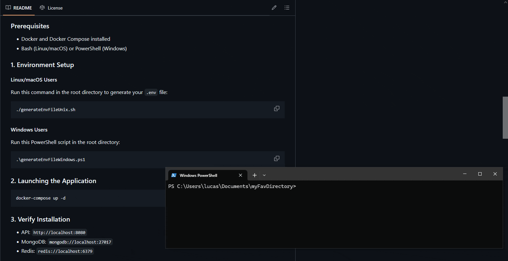

# Movie API REST (MVC)


**Project Resume:**

The **Movie API** is an API designed to manage an online film review application, allowing user interaction through comments. It includes abstract representations of movies, directors, users, and actors, with features such as following other users (who can be critics, regular users, or admins).

Users can also create lists of their favorite films, which are displayed on their profiles. Additionally, a reporting system has been implemented, allowing users to flag inappropriate reviews for admin review and action.

---

## **📝 Table of Contents**

1. [Installation](#-installation)
   - [Postman Collection](#-postman-collection)
2. [Functional Requirements](#-functional-requirements)
   - [Auth & Users](#-auth--users)
   - [Movie Management](#-movie-management)
   - [Reviews & Ratings](#-reviews--ratings)
   - [Social Interactions](#-social-interactions)
3. [Non-Functional Requirements](#️-non-functional-requirements)
   - [Security](#security)
   - [Performance](#performance)
   - [Usability](#usability)
4. [Business Rules](#more-business-rules)

---

## **🚀 Installation**

### **Prerequisites**

- Docker and Docker Compose installed
- Bash (Linux/macOS) or PowerShell (Windows)

### **1. Environment Setup**

#### **Linux/macOS Users**

Run this command in the root directory to generate your `.env` file:

```bash
./generateEnvFileUnix.sh
```

#### **Windows Users**

Run this PowerShell script in the root directory:

```powershell
.\generateEnvFileWindows.ps1
```



### **2. Launching the Application**

```bash
docker-compose up -d
```


### **3. Verify Installation**

- API: `http://localhost:8080`
- MongoDB: `mongodb://localhost:27017`
- Redis: `redis://localhost:6379`

### **4. Common Commands**

| Action        | Command                            |
| ------------- | ---------------------------------- |
| Stop services | `docker-compose down`              |
| View logs     | `docker-compose logs -f`           |
| Rebuild API   | `docker-compose up -d --build api` |

The system will automatically:

- Configure MongoDB with persistent storage
- Set up Redis with health monitoring
- Build and deploy your API with all environment variables

---

## **🔐 Functional Requirements**

### **Auth & Users**

| ID       | Description                                           |
| -------- | ----------------------------------------------------- |
| **RF01** | User management (Create, Read, Update, Delete - CRUD) |
| **RF02** | JWT-based authentication                              |
| **RF03** | User roles (Regular, Critic, Admin)                   |
| **RF04** | Login/Logout routes                                   |
| **RF05** | Token refresh route using HTTP-only cookies           |

### **🎬 Movie Management**

| ID       | Description                                     |
| -------- | ----------------------------------------------- |
| **RF06** | Full CRUD operations for movies                 |
| **RF07** | List of actors and directors                    |
| **RF09** | Category/collection system for organizing films |

### **✍️ Reviews & Ratings**

| ID       | Description                                                 |
| -------- | ----------------------------------------------------------- |
| **RF10** | Create/edit reviews with ratings (1-5) and spoiler warnings |
| **RF11** | Like system and comment functionality                       |
| **RF13** | Reporting system for inappropriate content                  |

### **🤝 Social Interactions**

| ID       | Description                          |
| -------- | ------------------------------------ |
| **RF14** | Follow users and view activity feeds |
| **RF15** | Create custom movie lists            |
| **RF16** | Private messaging system             |

---

## **🛠️ Non-Functional Requirements**

### **Security**

| ID    | Description                                           |
| ----- | ----------------------------------------------------- |
| RNF01 | JWT authentication with token expiration              |
| RNF03 | Input validation and sanitization for all user inputs |
| RNF04 | Password hashing using bcrypt                         |
| RNF05 | Redis-based token denylist for invalidated JWT tokens |

### **Performance**

| ID    | Description                               |
| ----- | ----------------------------------------- |
| RNF06 | 95% of requests must respond within 500ms |
| RNF07 | Redis caching for listing endpoints       |
| RNF08 | Default pagination for list endpoints     |

### **Usability**

| ID    | Description                            |
| ----- | -------------------------------------- |
| RNF14 | Complete Swagger/OpenAPI documentation |
| RNF16 | Clear and standardized error messages  |

## **📌 Use Cases**

Below are the primary use cases supported by the Movie API, categorized by functionality:

### **🎥 Movie Management**
- **CRUD Operations**: Create, Read, Update, and Delete movies.  
- **Upload Movie Poster**: Add or update images for movie posters.  
- **Manage Categories**: Organize movies into categories or collections.  
- **Search Movies**: Filter movies by title, director, actor, or category.  

### **👥 User Interactions**
- **Account Management**: Register, update, or delete user accounts.  
- **Follow Users**: Follow critics, regular users, or admins to view their activity.  
- **Moderate Users**: Admins can block, remove, or review user activity.  
- **Settings**: Update passwords or recover accounts.  

### **✍️ Reviews & Feedback**
- **Rate and Review**: Submit ratings (1-5) and reviews with spoiler warnings.  
- **Comment on Reviews**: Engage with other users by commenting on their reviews.  
- **Report Content**: Flag inappropriate reviews or comments for admin moderation.  
- **Authenticate Critics**: Verify the authenticity of critic accounts.  

### **🖼️ Media Handling**
- **Provide Image Units**: Support for uploading user avatars and movie posters.  

### **🔍 Discovery**
- **Find Critics/Reviews**: Search for critics or specific reviews.  
- **Create Custom Lists**: Curate personal lists of favorite movies.  

---

### **Key Scenarios**
1. **User Submits a Review**:  
   - A user logs in, searches for a movie, and submits a review with a rating.  
   - The review appears on the movie’s page and the user’s profile.  

2. **Admin Moderates Content**:  
   - An admin reviews reported content, decides to remove it, and optionally blocks the offending user.  

3. **User Follows a Critic**:  
   - A regular user follows a critic to receive updates on their reviews and activity.  

4. **Password Recovery**:  
   - A user requests a password reset, receives a secure link via email, and updates their credentials.  

---

### **Integration with Functional Requirements**
These use cases align with the [Functional Requirements](#-functional-requirements) to ensure:  
- **Auth & Users**: Secure account handling (RF01-RF05).  
- **Movie Management**: Structured film data (RF06-RF09).  
- **Reviews & Social**: Engagement features (RF10-RF16).  

For implementation details, refer to the [Postman Collection](#-postman-collection) or [Swagger docs](#need-help).

## **📡 Postman Collection**

### **Description**

If you prefer not to use Swagger for API exploration, you can import the provided **Postman Collection** located at:  
`./project/postman/MovieApi.postman_collection.json`

### **Import Instructions**

1. Open Postman and click **"Import"**
2. Select the JSON file or drag-and-drop it into Postman
3. Once imported, you’ll see all available API endpoints organized by category


### **Key Features**

- **Auto-Token Refresh**: Each request includes a **pre-request script** that automatically obtains a valid `accessToken` via JWT refresh:
  ```javascript
  pm.sendRequest(
    {
      url: "http://localhost:8080/refresh-token", // Update if needed
      method: "POST",
      headers: {
        "Content-Type": "application/json",
        Authorization: "Bearer {{accessToken}}",
      },
    },
    (err, res) => {
      if (err) {
        console.error("Refresh token error:", err);
      } else {
        const newToken = res.json().accessToken;
        if (newToken) {
          pm.globals.set("accessToken", newToken);
          console.log("Token refreshed successfully");
        }
      }
    }
  );
  ```
- **Environment Ready**: The collection uses Postman variables for seamless testing.
- **Structured Endpoints**: Routes are grouped by functionality (Auth, Movies, Reviews, etc.).

---

### **Why Use This Collection?**

✅ **Saves time** with pre-configured auth flows  
✅ **Documents all endpoints** with example requests/responses  
✅ **Easily extensible** for testing edge cases

**Tip**: After import, check Postman’s **"Tests"** tab for built-in response validations.

## **📜 More Business Rules**

1. A user cannot follow themselves
2. Users cannot follow the same person multiple times

---

**Need Help?**  
Check the Swagger docs at `http://localhost:8080/api-docs` after startup!
