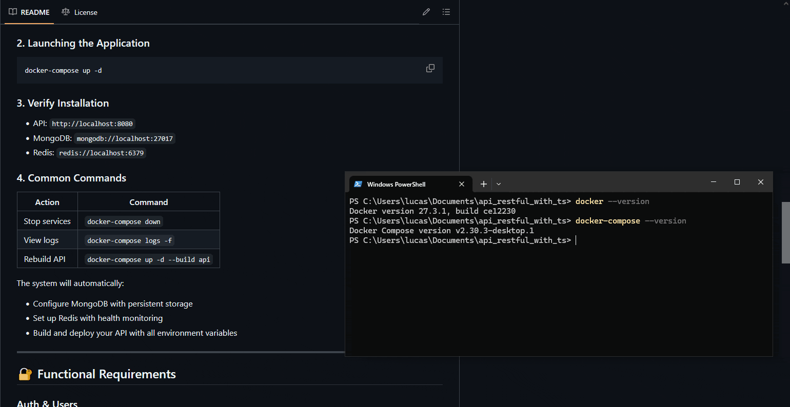
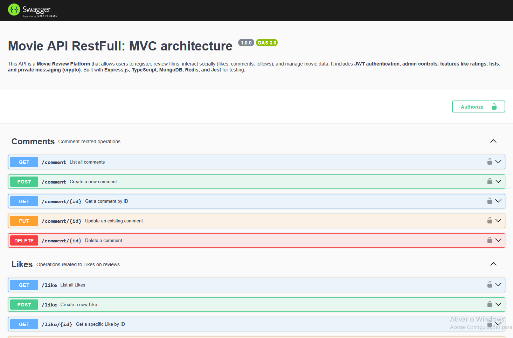

# CineVerse API (MVC)


**Project Resume:**

The **CineVerse (Movie API)** is an API designed to manage an online film review application, allowing user interaction through comments. It includes abstract representations of movies, directors, users, and actors, with features such as following other users (who can be critics, regular users, or admins).

Users can also create lists of their favorite films, which are displayed on their profiles. Additionally, a reporting system has been implemented, allowing users to flag inappropriate reviews for admin review and action.

---

## **📝 Table of Contents**

### **1. Project Overview**

- [Introduction](#cineverse-api-mvc)

### **2. Setup & Installation**

- [🚀 Production Setup](#-installation)
  - [Prerequisites](#-prerequisites)
  - [Environment Setup](#1-environment-setup)
  - [Launching the Application](#2-launching-the-application)
  - [Verification](#3-verify-installation)
- [🛠️ Development Setup](#-development-setup-dev)
  - [Local Database Setup](#1-setup-databases-with-docker-optional)
  - [Running the API](#4-run-the-api-in-development-mode)
  - [DEV vs PROD Comparison](#key-differences-dev-vs-prod)

### **3. Functional Requirements**

- [🔐 Auth & Users](#-auth--users)
- [🎬 Movie Management](#-movie-management)
- [✍️ Reviews & Ratings](#-reviews--ratings)
- [🤝 Social Interactions](#-social-interactions)

### **4. Non-Functional Requirements**

- [Security](#security)
- [Performance](#performance)
- [Usability](#usability)

### **5. Use Cases & Business Rules**

- [📌 Use Cases](#-use-cases)
  - [Movie Management](#-movie-management-1)
  - [User Interactions](#-user-interactions)
  - [Reviews & Feedback](#-reviews--feedback)
  - [Discovery](#-discovery)
- [📜 Business Rules](#-more-business-rules)

### **6. API Documentation**

- [📡 Postman Collection](#-postman-collection)
- [📚 Swagger Documentation](#-swagger-documentation)

### **7. Testing & Quality Assurance**

- [🧪 Implementation Tests](#-implementation-tests)
  - [Test Summary](#-test-summary)
  - [Test Categories](#-test-categories)
  - [How to Run Tests](#-how-to-run-tests)

---

## **🚀 Installation**

### **Prerequisites**

- Docker and Docker Compose installed
- Bash (Linux/macOS) or PowerShell (Windows)

### **1. Environment Setup**

#### **Linux/macOS Users**

Run this command in the root directory to generate your `.env` file:

```bash
./generateEnvFileUnix.sh
```

#### **Windows Users**

Run this PowerShell script in the root directory:

```powershell
.\generateEnvFileWindows.ps1
```


### **2. Launching the Application**

```bash
docker-compose up -d
```



### **3. Verify Installation**

- API: `http://localhost:8080`
- MongoDB: `mongodb://localhost:27017`
- Redis: `redis://localhost:6379`

### **4. Common Commands**

| Action        | Command                            |
| ------------- | ---------------------------------- |
| Stop services | `docker-compose down`              |
| View logs     | `docker-compose logs -f`           |
| Rebuild API   | `docker-compose up -d --build api` |

The system will automatically:

- Configure MongoDB with persistent storage
- Set up Redis with health monitoring
- Build and deploy your API with all environment variables

---

# 🛠️ Development Setup (DEV)

For developers who want to contribute or run the API in development mode (without Docker Compose), follow these steps:

## **Prerequisites**

- Node.js (v18+ recommended)
- MongoDB (local or Docker)
- Redis (local or Docker)
- npm

## **1. Setup Databases with Docker (Optional)**

Run these commands to start MongoDB and Redis in containers:

```bash
docker run -d --name mongodb-dev -p 27017:27017 mongo
docker run -d --name redis-dev -p 6379:6379 redis
```

## **2. Generate DEV Environment File**

Execute the environment generator script and select **"dev"** when prompted:

### Linux/macOS

```bash
./generateEnvFileUnix.sh
```

### Windows (PowerShell)

```powershell
.\generateEnvFileWindows.ps1
```

When asked:  
`Is this for development? (dev/prod):` → Type **`dev`**

This will generate a `.env` file optimized for local development.

## **3. Install Dependencies**

```bash
npm install
```

## **4. Run the API in Development Mode**

```bash
npm run dev

```

The API will start with:

- **Hot-reload** (changes trigger automatic restarts)

---

### **Key Differences: DEV vs PROD**

| Feature      | Development (`dev`)   | Production (`prod`)        |
| ------------ | --------------------- | -------------------------- |
| **Logging**  | Verbose (debug level) | Warnings/errors only       |
| **CORS**     | Allowed for localhost | Restricted to prod domains |
| **Database** | Local MongoDB/Redis   | Dockerized services        |

## **🔐 Functional Requirements**

### **Auth & Users**

| ID       | Description                                           |
| -------- | ----------------------------------------------------- |
| **RF01** | User management (Create, Read, Update, Delete - CRUD) |
| **RF02** | JWT-based authentication                              |
| **RF03** | User roles (Regular, Critic, Admin)                   |
| **RF04** | Login/Logout routes                                   |
| **RF05** | Token refresh route using HTTP-only cookies           |

### **🎬 Movie Management**

| ID       | Description                                     |
| -------- | ----------------------------------------------- |
| **RF06** | Full CRUD operations for movies                 |
| **RF07** | List of actors and directors                    |
| **RF09** | Category/collection system for organizing films |

### **✍️ Reviews & Ratings**

| ID       | Description                                                 |
| -------- | ----------------------------------------------------------- |
| **RF10** | Create/edit reviews with ratings (1-5) and spoiler warnings |
| **RF11** | Like system and comment functionality                       |
| **RF13** | Reporting system for inappropriate content                  |

### **🤝 Social Interactions**

| ID       | Description                          |
| -------- | ------------------------------------ |
| **RF14** | Follow users and view activity feeds |
| **RF15** | Create custom movie lists            |
| **RF16** | Private messaging system             |

---

## **🛠️ Non-Functional Requirements**

### **Security**

| ID    | Description                                           |
| ----- | ----------------------------------------------------- |
| RNF01 | JWT authentication with token expiration              |
| RNF03 | Input validation and sanitization for all user inputs |
| RNF04 | Password hashing using bcrypt                         |
| RNF05 | Redis-based token denylist for invalidated JWT tokens |

### **Performance**

| ID    | Description                               |
| ----- | ----------------------------------------- |
| RNF06 | 95% of requests must respond within 500ms |

### **Usability**

| ID    | Description                            |
| ----- | -------------------------------------- |
| RNF07 | Complete Swagger/OpenAPI documentation |
| RNF08 | Clear and standardized error messages  |

## **📌 Use Cases**

Below are the primary use cases supported by the Movie API, categorized by functionality:


### **🎥 Movie Management**

- **CRUD Operations**: Create, Read, Update, and Delete movies.
- **Upload Movie Poster**: Add images for movie posters via url.
- **Manage Categories**: Organize movies into categories or collections.
- **Search Movies**: Filter movies by title, director, actor, or category.

### **👥 User Interactions**

- **Account Management**: Register, update, or delete user accounts.
- **Follow Users**: Follow critics, regular users, or admins to view their activity.

### **✍️ Reviews & Feedback**

- **Rate and Review**: Submit ratings (1-5) and reviews with spoiler warnings.
- **Comment on Reviews**: Engage with other users by commenting on their reviews.
- **Report Content**: Flag inappropriate reviews or comments for admin moderation.

### **🔍 Discovery**

- **Find Critics/Reviews**: Search for critics or specific reviews.
- **Create Custom Lists**: Curate personal lists of favorite movies.

---

### **Key Scenarios**

1. **User Submits a Review**:

   - A user logs in, searches for a movie, and submits a review with a rating.
   - The review appears on the movie’s page and the user’s profile.

2. **Admin Moderates Content**:

   - An admin reviews reported content, decides to remove it, and optionally blocks the offending user.

3. **User Follows a Critic**:

   - A regular user follows a critic to receive updates on their reviews and activity.

4. **Password Recovery**:
   - A user requests a password reset, receives a secure link via email, and updates their credentials.

---

### **Integration with Functional Requirements**

These use cases align with the [Functional Requirements](#-functional-requirements) to ensure:

- **Auth & Users**: Secure account handling (RF01-RF05).
- **Movie Management**: Structured film data (RF06-RF09).
- **Reviews & Social**: Engagement features (RF10-RF16).

For implementation details, refer to the [Postman Collection](#-postman-collection) or [Swagger docs](#need-help).

## **📡 Postman Collection**

### **Description**

If you prefer not to use Swagger for API exploration, you can import the provided **Postman Collection** located at:  
`./project/postman/MovieApi.postman_collection.json`

### **Import Instructions**

1. Open Postman and click **"Import"**
2. Select the JSON file or drag-and-drop it into Postman
3. Once imported, you’ll see all available API endpoints organized by category


### **Key Features**

- **Auto-Token Refresh**: Each request includes a **pre-request script** that automatically obtains a valid `accessToken` via JWT refresh:
  ```javascript
  pm.sendRequest(
    {
      url: "http://localhost:8080/refresh-token", // Update if needed
      method: "POST",
      headers: {
        "Content-Type": "application/json",
        Authorization: "Bearer {{accessToken}}",
      },
    },
    (err, res) => {
      if (err) {
        console.error("Refresh token error:", err);
      } else {
        const newToken = res.json().accessToken;
        if (newToken) {
          pm.globals.set("accessToken", newToken);
          console.log("Token refreshed successfully");
        }
      }
    }
  );
  ```
- **Environment Ready**: The collection uses Postman variables for seamless testing.
- **Structured Endpoints**: Routes are grouped by functionality (Auth, Movies, Reviews, etc.).

---

### **Why Use This Collection?**

✅ **Saves time** with pre-configured auth flows  
✅ **Documents all endpoints** with example requests/responses  
✅ **Easily extensible** for testing edge cases

## **🧪 Implementation Tests**

The Movie API has been thoroughly tested to ensure all functionalities work as expected. Below is a summary of the test results, organized by module and endpoint.


---

### **📊 Test Summary**

- **Total Test Suites**: 11
- **Total Tests**: 54
- **Pass Rate**: 100%
- **Execution Time**: ~37 seconds

---

### **🔍 Test Categories**

#### **1. Core Functionality**

| Module       | Endpoints Tested                                                                     | Pass/Fail     |
| ------------ | ------------------------------------------------------------------------------------ | ------------- |
| **Movie**    | `POST /movie`, `GET /movie`, `GET /movie/:id`, `PUT /movie/:id`, `DELETE /movie/:id` | ✅ All Passed |
| **Actor**    | `POST /actor`, `GET /actor`, `PUT /actor/:id`, `DELETE /actor/:id`                   | ✅ All Passed |
| **Director** | `POST /director`, `GET /director`, `PUT /director/:id`, `DELETE /director/:id`       | ✅ All Passed |
| **User**     | `POST /user`, `GET /user`, `GET /user/:id`, `PUT /user/:id`, `DELETE /user/:id`      | ✅ All Passed |

#### **2. Content Management**

| Module      | Endpoints Tested                                                                               | Pass/Fail     |
| ----------- | ---------------------------------------------------------------------------------------------- | ------------- |
| **Review**  | `POST /review`, `GET /review`, `GET /review/:id`, `PUT /review/:id`, `DELETE /review/:id`      | ✅ All Passed |
| **Like**    | `POST /like`, `GET /like`, `GET /like/:id`, `PUT /like/:id`, `DELETE /like/:id`                | ✅ All Passed |
| **List**    | `POST /list`, `GET /list`, `GET /list/:id`, `PUT /list/:id`, `DELETE /list/:id`                | ✅ All Passed |
| **Comment** | `POST /comment`, `GET /comment`, `GET /comment/:id`, `PUT /comment/:id`, `DELETE /comment/:id` | ✅ All Passed |

#### **3. Social Interactions**

| Module      | Endpoints Tested                                                                               | Pass/Fail     |
| ----------- | ---------------------------------------------------------------------------------------------- | ------------- |
| **Message** | `POST /message`, `GET /message`, `GET /message/:id`, `PUT /message/:id`, `DELETE /message/:id` | ✅ All Passed |
| **Follow**  | `POST /follow`, `GET /follow`, `GET /follow/:id`, `PUT /follow/:id`, `DELETE /follow/:id`      | ✅ All Passed |
| **Report**  | `POST /report`, `GET /report`, `GET /report/:id`, `PUT /report/:id`, `DELETE /report/:id`      | ✅ All Passed |

---

- **Performance Metrics**:
  - Fastest endpoint: `DELETE /movie/:id` (~10ms).
  - Slowest endpoint: `GET /actor` (~481ms due to large dataset test more 3000 itens).

---

### **✅ Validation Criteria**

1. **CRUD Operations**: All create, read, update, and delete endpoints function correctly.
2. **Edge Cases**:
   - Users cannot follow themselves (business rule enforced).
   - Duplicate likes/reports are prevented.
3. **Error Handling**: Invalid IDs or unauthorized requests return standardized errors.

---

### **🔧 How to Run Tests**

1. Navigate to the project root:
   ```bash
   cd /path/to/api_restful_with_ts
   ```
2. Execute tests:
   ```bash
   npm run test
   ```
3. View detailed logs in the console or export to a file:
   ```bash
   npm run test > test_results.log
   ```

---

### **📌 Notes**

- **Redis/MongoDB**: Tests automatically handle DB connections and disconnections.
- **CI/CD Ready**: Integrate with tools like GitHub Actions for automated testing.

For troubleshooting, check the Swagger docs at `http://localhost:8080/api-docs` or the [Postman Collection](#-postman-collection).

---

**Next Steps**:

- Add integration tests for combined workflows (e.g., creating a review + liking it).
- Monitor performance under load with tools like Artillery.

## **📜 More Business Rules**

1. A user cannot follow themselves
2. Users cannot follow the same person multiple times

---

# 📚 Swagger Documentation

The Movie API includes **automatically generated Swagger (OpenAPI) documentation**, providing an interactive way to explore all endpoints, models, and request/response examples.

## **🔍 Accessing Swagger UI**

After starting the API (either in `dev` or `prod` mode), open:

🔗 **[http://localhost:8080/api-docs](http://localhost:8080/api-docs)**



---

## **📖 Key Sections**

### **1. Authentication (`/auth`)**

- **Login (`POST /auth/login`)**
- **Refresh Token (`POST /auth/refresh-token`)**
- **Logout (`POST /auth/logout`)**


### **2. Movies (`/movies`)**

- **CRUD Operations**
- **Search & Filtering**
- **Poster Upload (via URL)**


### **3. Users (`/users`)**

- **User Registration & Management**
- **Follow/Unfollow System**
- **Profile Customization**


### **4. Reviews & Comments (`/reviews`, `/comments`)**

- **Create/Edit Reviews (with ratings 1-5)**
- **Like/Unlike Reviews**
- **Report Inappropriate Content**


### **5. Lists (`/lists`)**

- **Create Custom Movie Lists**
- **Public/Private Visibility**
- **Add/Remove Movies**

---

## **🛠️ How to Test Endpoints in Swagger**

1. **Authorize** → Click the **🔒 Lock Icon** and enter a valid JWT token (obtained from `/auth/login`).

2. **Try It Out** → Click the **"Try it out"** button on any endpoint.

3. **Modify Parameters** → Edit JSON payloads or query params as needed.

4. **Execute** → Hit **"Execute"** and see the live response!

